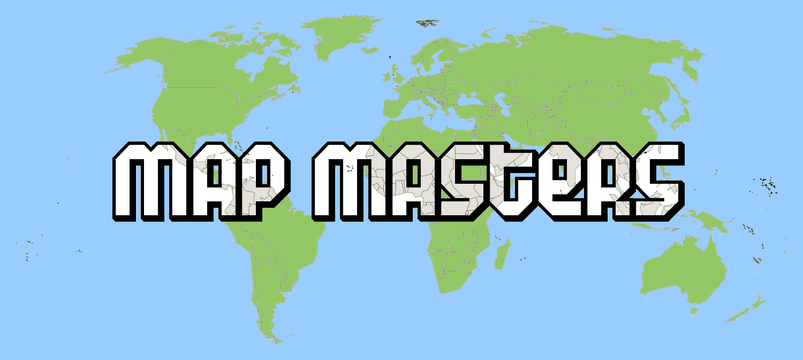

# map-masters

This is a re-upload of an old student project by done in 2011 by Johan Schedin Jigland, Fredrik Román, Oskar Höglund, Nikolai Padyukov, Kim Torgensen, Christian Castillo, Joakim Lahtinen, Mihgyuan Jiang, Johan Berg, Andreas Norberg. 

It was previously hosted on Google Code, and somewhere along the way a couple of files went missing, namely the playable continents. Only Oceania is actually playable.

The goal of the game is to be able to name as many countries of a specific continent as fast as possible. There are scoreboards and multiple difficulty levels.
